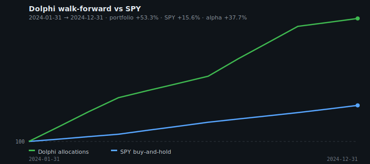
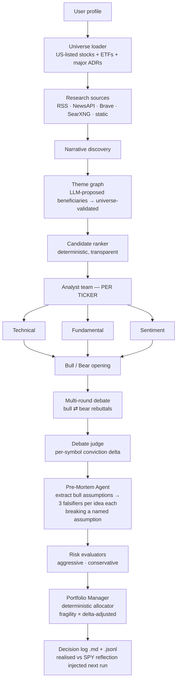

# 🐬 Dolphi

[](https://github.com/mhlaghari/dolphiv2/actions/workflows/ci.yml)
[](LICENSE)
[](pyproject.toml)
[](tests/)
[](pyproject.toml)
[](https://github.com/mhlaghari/dolphiv2/releases/tag/v0.2.0)

> **A thesis-interrogation primitive for investment research.** Python library + MCP server + CLI that proves a bull case wrong before recommending anything.

Dolphi is a local-first, open-source research engine inspired by
[TauricResearch/TradingAgents](https://github.com/TauricResearch/TradingAgents).
TradingAgents answers *"should I buy this ticker?"*. Dolphi answers a sharper pair of questions:

1. **What should I consider — and why?** (multi-source narrative discovery + theme expansion)
2. **Where is this thesis weakest?** (a dedicated *Pre-Mortem Agent* whose only job is to break it)

Use it three ways:
- **As a library** — `from dolphi.api import evaluate` from inside your own trading agent.
- **As an MCP server** — `dolphi-mcp` exposes evaluation, falsifier checks, and decision-log queries to Claude Desktop, Cursor, or any MCP client.
- **As a CLI** — `dolphi --check` for the weekly Monday-morning research loop.

For research and education only. Not financial, investment, or trading advice.

```python
from dolphi.api import evaluate

result = evaluate(symbols=["NVDA", "AMD"], mock=True)
for symbol, falsifiers in result.falsifiers.items():
    print(f"\n{symbol} (fragility: {result.fragility[symbol]:.2f})")
    for f in falsifiers:
        print(f"  - {f.failure_mode} (watch: {f.leading_indicator})")
```

> The `dolphi.api` facade and `dolphi-mcp` server ship in v0.3 (in progress).

---

## Why this exists

Most "LLM trading" projects are bull/bear simulators. A bull and a bear are
**both forecasters**. They argue about the future, but neither of them
tries to *disprove* the thesis. That's a missing epistemic step, and it's
the step that separates research from rationalisation.

Dolphi adds a **Pre-Mortem Agent** as a first-class node in the graph. After
the bull/bear debate, this agent ignores the thesis entirely and asks the
opposite question: *"What is the cheapest, fastest, most observable event
that would prove all of this wrong?"* Every recommendation comes with three
named falsifiers, each with a probability and a leading indicator you can
monitor.

If the falsifiers are cheap and likely, the recommendation gets downsized
or dropped. If they are expensive and unlikely, the recommendation earns
its weight.

---

## ✨ What's new in v0.2.0

- 🔍 **`dolphi --check`** — the retention loop. Loads the most recent decision, walks every leading indicator the pre-mortem named, prompts `[S]till safe / [T]riggered / [U]nsure` per falsifier, then suggests position-size adjustments per symbol. Built for Monday-morning research check-ins.
- 🎨 **Colourful CLI** — DOLPHI ASCII banner at every entry point; Rich-styled portfolio table with fragility-graded weight column (green/yellow/red) and bull/bear conviction-delta cells. `dolphi --mock-data --seed-symbol NVDA`.
- 🇦🇪 **UAE markets** — 28 of the largest DFM + ADX listings (IHC, FAB, TAQA, ADNOC Gas/Dist, EMAAR, DEWA, ENBD, …) ranked alongside US names. `dolphi --include-uae`.
- 🏆 **Falsifier-quality eval** — `python -m dolphi.eval` benchmarks LLMs on how good their pre-mortem falsifiers are (horizon observability + assumption coherence + indicator specificity + probability calibration), emitting markdown / CSV / JSON leaderboards.
- 💾 **Saved investor profile** at `~/.dolphi/profile.json` with hotkey prompts (`[U]SD / [E]UR / [G]BP / [A]ED / …`) and a `[Y]es / [E]dit / [N]ew` flow on every run.
- 💰 **`investment_percentage` field** — choose what fraction of savings to deploy; the rest stays as cash buffer outside the strategy and shows up as a separate line.

Full release notes: [v0.2.0](https://github.com/mhlaghari/dolphiv2/releases/tag/v0.2.0).

---

## What makes Dolphi different

- 🧨 **Pre-Mortem agent** — for every idea, an LLM call extracts the
  bull's *named load-bearing assumptions*, then a per-symbol call
  produces three falsifiers, each forced to break one named assumption
  inside a stated horizon ≤ 12 months with a weekly-checkable
  indicator. The deterministic allocator down-weights ideas by their
  fragility.
- ⚖️ **Real multi-round debate with a judge that votes** — bull and
  bear actually rebut each other for N rounds (default 2). A judge
  node then issues a per-symbol verdict + bounded conviction delta
  (-0.3 … +0.3) that the allocator adds to the score *before* sizing.
- 🕸 **LLM-driven theme graph** — narrative-to-beneficiary mapping is
  no longer a hard-coded keyword table. The LLM proposes US-listed
  tickers per narrative and every proposal is universe-validated and
  asset-class-filtered.
- 🔁 **Closed-loop reflection on realised returns** — every decision
  writes a machine-readable JSONL sidecar. On the next run, Dolphi
  refetches prices, computes per-symbol and portfolio-level alpha vs
  SPY, and feeds it into the portfolio manager prompt so the agent
  must address its own track record before issuing new calls.

All four ship today on `main`. `pytest` shows **184 passing tests** and
the codebase is `ruff` clean.

---

## Model leaderboard — who writes the sharpest falsifiers?

The Pre-Mortem agent is only as good as the model behind it. `docs/eval/falsifier_quality.md`
benchmarks seven LLMs (Anthropic Opus 4.7 / Sonnet 4.6 / Haiku 4.5, DeepSeek V4-Pro /
V4-Flash, Ollama Llama 3 / Qwen 2.5) on eight curated bull-case fixtures across AI capex,
semiconductor pricing, energy transition, GLP-1, defence, China/ADR risk, regional
banking, and rate-sensitive REITs. Each falsifier is graded on four axes by a fixed
judge model:

- **horizon observability** — is the predicted event verifiable inside ≤12 months?
- **assumption coherence** — does the falsifier actually break the assumption it names?
- **indicator specificity** — is the leading indicator concretely checkable each week?
- **probability calibration** — is the estimate defensible for the stated horizon?

The leaderboard, raw per-falsifier rows, and full prompt audit trail (for
reproducibility) land in `docs/eval/` once a run is recorded. Reproduce locally:

```bash
python -m dolphi.eval \
    --models anthropic:claude-sonnet-4-6,deepseek:v4-pro,ollama:llama3:8b \
    --fixtures all \
    --judge anthropic:claude-sonnet-4-6 \
    --out docs/eval/
```

> *Eval harness is being added in v0.2.0 (in progress). The methodology, fixtures,
> judge rubric, and report format are versioned in this repository so the published
> leaderboard remains independently re-runnable.*

<!-- TODO: when T-EVAL runs, this section will link to docs/eval/falsifier_quality.md -->

---

## Walk-forward backtest (sanity check)

Dolphi can grade its own past recommendations against SPY buy-and-hold.
Every run writes a JSONL sidecar; `--backtest` replays those allocations
on a monthly cadence and compounds hold-period returns.



*Demo fixture (`--mock-data`): synthetic prices, bundled quarterly
rebalance decisions. Not a live track record.*

```bash
# Offline demo → writes docs/benchmarks/equity_curve.svg + metrics JSON
dolphi --backtest --mock-data

# Your ~/.dolphi/decision_log.jsonl vs live yfinance prices
dolphi --backtest --backtest-output docs/benchmarks
```

The backtest is a **sanity check**, not the product pitch. Dolphi's claim
is more honest research via falsification — not guaranteed alpha.

---

## 🔍 Weekly check (the retention loop)

Every falsifier the pre-mortem agent writes is bound by contract to name a
**weekly-checkable leading indicator** — a concrete measurable quantity a
researcher could look at next Monday and tell whether the thesis is still
intact. `dolphi --check` is the obvious next step:

```bash
dolphi --check
```

It loads the most recent decision from `~/.dolphi/decision_log.jsonl`,
walks through every indicator (typically 15 — five symbols × three
falsifiers each), and prompts:

```
Status? [S]till safe  [T]riggered  [U]nsure
```

When the loop finishes, Dolphi tabulates a **position-size suggestion**:
each triggered falsifier shaves 30 % off that symbol's weight, each
unsure shaves 10 %, capped at a 90 % reduction. Nothing is rebalanced
automatically — the suggestion is intentionally something the user has
to act on, because the point is to make the falsification step
*recurring*, not one-shot.

This is what turns Dolphi from "use once, say so what?" into "open every
Monday." The data model already had every leading indicator persisted —
`dolphi --check` just surfaces them.

---

## Glossary

- **Falsifier** — a concrete scenario that would prove the bull case wrong. Each one names a leading indicator you can check weekly.
- **Fragility** — how many of a thesis's load-bearing assumptions can be cheaply falsified. High fragility → smaller position size.
- **Pre-Mortem Agent** — the agent that ignores the thesis and asks "what's the cheapest way this breaks?" before recommending a weight.

---

## What Dolphi does (current architecture)



---

## How Dolphi compares to TradingAgents

|                              | TradingAgents                    | **Dolphi**                                                            |
|------------------------------|----------------------------------|-----------------------------------------------------------------------|
| Question answered            | "Should I buy `TICKER`?"         | "What should I consider, and how can I break it?"                     |
| Input                        | A ticker + a date                | A risk profile + an open universe                                     |
| Discovery step               | —                                | Narrative + LLM-driven theme-graph (universe-validated)               |
| Bull / bear debate           | ✓                                | ✓ multi-round + **judge node emitting per-symbol conviction deltas**  |
| **Pre-Mortem / falsifiers**  | —                                | **✓ assumption-grounded falsifiers, fragility lowers allocation**     |
| Deterministic allocator      | —                                | ✓ LLM rationale + hard caps + fragility multiplier + debate delta     |
| **Closed-loop reflection**   | —                                | **✓ realised return vs SPY on prior decisions is shown to the agent** |
| Local-first                  | Optional                         | Default (Ollama)                                                      |
| Free data by default         | Partial                          | yfinance · RSS · static · SearXNG                                     |
| License                      | Apache-2.0                       | MIT                                                                   |

---

## Quickstart

```bash
# One-command demo (~30 s, no API keys)
bash examples/quickstart.sh
```

See [`examples/01_evaluate_a_ticker.ipynb`](examples/01_evaluate_a_ticker.ipynb) — a runnable cookbook that walks through the full Dolphi pipeline (bull/bear debate, falsifiers, fragility, allocation, falsifier-check loop) end-to-end in mock mode.

```bash
# Install (editable, with dev deps)
pip install -e ".[dev]"

# First run — builds your investor profile (saved to ~/.dolphi/profile.json),
# then runs the full agent graph end-to-end. Offline; no API keys required.
dolphi --new-profile --mock-data --seed-symbol NVDA --top-k 5

# Next Monday — revisit every falsifier from the most recent decision
dolphi --check

# Rank UAE-listed names (DFM + ADX) alongside US listings
dolphi --include-uae --mock-data

# Walk-forward backtest vs SPY (offline demo with bundled decisions)
dolphi --backtest --mock-data --backtest-start 2024-01-31 --backtest-end 2024-12-31

# Backtest your own decision log against live prices
dolphi --backtest

# Live discovery with the default broad-market research agenda
dolphi

# Verbose, with per-agent reasoning
dolphi --verbose

# Specify model and provider
dolphi --provider deepseek --model deepseek-v4-flash

# Optional: enable long-term memory (ChromaDB)
dolphi --use-memory

# Live Rich dashboard while agents run
dolphi --mock-data --tui
```

The first run will create `~/.dolphi/` for the SQLite cache, the decision
log, and the optional Chroma memory store.

### Prerequisites

- Python ≥ 3.10
- One of:
  - [Ollama](https://ollama.ai) with at least one local model (e.g. `llama3:8b`) — default, free.
  - Or a key for OpenAI / OpenRouter / DeepSeek (set in `.env`).
- Optional: `NEWSAPI_KEY`, `BRAVE_API_KEY`,
  `SEARXNG_BASE_URL` — each one unlocks an extra data source. None are
  required.

---

## Configuration

`config.json` chooses the active LLM provider/model and research depth:

```json
{
  "llm": {
    "provider": "deepseek",
    "model": "deepseek-v4-flash"
  },
  "research": {
    "depth": "deep"
  }
}
```

Environment variables override the file (`LLM_PROVIDER`, `LLM_MODEL`,
`RESEARCH_DEPTH`, `OLLAMA_ENDPOINT`, etc.). CLI flags override both.

---

## Project layout

```
dolphi/
├── agents/            bull · bear · debate · debate_judge · risk_* · pre_mortem · portfolio_manager
├── allocation/        deterministic portfolio sizer with risk caps + fragility + debate delta
├── data/              yfinance · newsapi wrappers + SQLite cache
├── graph/             LangGraph workflow wiring
├── ideas/             discovery pipeline (narrative + theme + ranking)
├── llm/               provider-agnostic client factory (Ollama + OpenAI-compatible)
├── memory/            ChromaDB long-term memory + Markdown + JSONL decision log + reflection
├── research/          sources + narrative grouping + LLM beneficiary mapper (keyword fallback)
├── scoring/           transparent composite ranker
├── themes/            second-order beneficiary expander (LLM-aware)
├── backtest/          walk-forward backtester + SVG chart + demo fixture
└── universe/          loader · validator · ADR/ETF schema · NASDAQ/NYSE feed
docs/benchmarks/       generated equity curve + metrics (from `dolphi --backtest`)
PLAN.md                roadmap & shipped-by-phase decisions
tests/                 unit tests (184, run with `pytest`)
```

See `PLAN.md` for the full roadmap.

---

## 🇦🇪 UAE markets

Pass `--include-uae` and Dolphi extends the universe with 28 of the
largest DFM (Dubai Financial Market) and ADX (Abu Dhabi Securities
Exchange) listings — IHC, FAB, TAQA, ADNOC Gas / Distribution / Drilling /
Logistics, ADCB, ADIB, e&, Aldar, AD Ports, Borouge, Multiply,
PureHealth, Burjeel, Agthia on ADX; EMAAR, Emaar Development, DEWA,
Emirates NBD, DIB, du, Salik, Parkin, TECOM, Taaleem, Air Arabia on DFM.

```bash
dolphi --include-uae --mock-data --top-k 5
```

UAE tickers carry the `.AE` suffix on yfinance (e.g. `IHC.AE`,
`EMAAR.AE`) — that suffix is load-bearing and is preserved by the UAE
loader. If a symbol can't be priced by yfinance it's silently dropped
downstream; the universe load itself never fails.

If your saved investor profile has `currency: AED`, you probably want
to keep `--include-uae` on by default — set an alias for it in your
shell:

```bash
alias dolphi='dolphi --include-uae'   # bash / zsh
function dolphi { command dolphi --include-uae @args }   # PowerShell
```

---

## Roadmap

- **Phase 0 — Credibility** ✅ Open universe loader, per-ticker analyst
  outputs, Pre-Mortem stub, rebrand to `dolphi`.
- **Phase 1 — The wedge** ✅
  - LLM-driven theme graph (narrative → LLM beneficiaries →
    universe-validated evidence pass).
  - Multi-round bull ⇌ bear debate with a judge that emits per-symbol
    conviction deltas the allocator actually consumes.
  - Real Pre-Mortem agent: extracts the bull's load-bearing
    assumptions, then fans out per-symbol to produce 3 falsifiers
    each, every falsifier required to break one of those assumptions.
  - Closed-loop reflection: realised returns vs SPY for prior
    recommendations are injected into the portfolio manager prompt on
    every new run, with both per-symbol alpha and a "best / worst" call-out.
- **Phase 2 — Proof** (in progress)
  - **P2.1 Walk-forward backtester** ✅ monthly cadence, decision-log
    JSONL replay, SVG equity curve vs SPY, `dolphi --backtest`.
  - **P2.2 Rich live TUI** ✅ `dolphi --tui` streams workflow state
    (ideas, debate, pre-mortem, allocation). GIF demo still TODO.
  - **P2.3 Technical note** ✅ `docs/technical-note.md` (draft).

---

## Testing

```bash
python -m pytest tests
```

All tests must pass with `--mock-data`; no network access required.

---

## Contributing

See `CONTRIBUTING.md`. Good first contributions: universe data sources,
research sources, falsifier prompts, allocation constraints, backtester.

---

## Licence

MIT.
