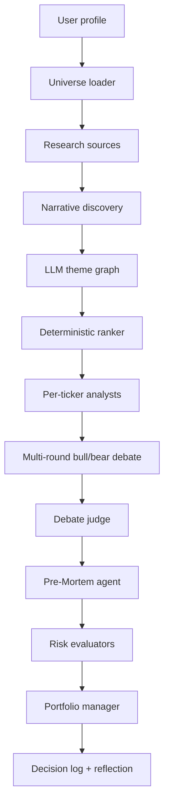

# Why bull/bear LLM agents will never be research

*Dolphi technical note. For research and education only — not financial advice.*

## 1. Problem framing

Most open-source "LLM trading" stacks, including
[TauricResearch/TradingAgents](https://github.com/TauricResearch/TradingAgents),
optimise for **ticker-level conviction**: given a symbol, produce bull and bear
forecasts and a trade recommendation.

This is a category error. **A bull and a bear are both forecasters.** They
argue about the future, but neither side is tasked with *disproving* the
thesis — and an argument between two forecasters is rhetoric, not research.
The missing epistemic step is **falsification**: the explicit attempt to name
the cheapest, fastest, most observable event that would prove the thesis wrong.

Compounding this, the typical bull/bear LLM setup invites three failure modes:

1. **Symmetric coverage masking asymmetric risk.** A bull case with three
   strong drivers and one fragile assumption looks "balanced" against a bear
   case with three vague macro worries. The bull wins on prose density; the
   fragile assumption is never named.
2. **The bear is also a forecaster.** A bear who predicts a recession is
   making a forward macro call, not breaking the bull's claim. Forecasters
   miss; falsifiers don't have to predict the future, only specify what
   evidence would change their mind.
3. **Adversarial debate produces consensus drift.** With multi-round
   rebuttals, both sides hedge toward "moderately positive with risks." The
   user gets nuance; the file drawer gets the original disagreement.

Dolphi inverts the epistemic order:

1. **Discovery** — What should a user even consider, given their risk profile
   and an open US-listed universe?
2. **Falsification** — For each candidate, what is the cheapest observable
   event that would break the bull case?

The product claim is *more honest research*, not guaranteed alpha.

## 2. Architecture



### 2.1 Per-ticker analysts

Technical, fundamental, and sentiment analysts each emit structured JSON:

```json
{
  "per_ticker": {
    "NVDA": {"reasoning": "...", "score": 0.7, "details": {}}
  },
  "overall_reasoning": "...",
  "overall_score": 0.4
}
```

This keeps token cost bounded (one LLM call per analyst) while giving downstream
nodes symbol-level context. Global `technical_analysis` fields remain as cohort
summaries for backward compatibility.

### 2.2 LLM theme graph

`map_beneficiaries()` asks an LLM for 5–8 US-listed tickers exposed to each
discovered narrative. Proposals are **universe-validated** and filtered by the
user’s asset-class preferences. A static keyword table remains as a per-narrative
fallback when the LLM fails.

### 2.3 Multi-round debate + judge

After opening bull/bear cases, Dolphi runs `N` rebuttal rounds (default 2). A
`debate_judge` node reads the full transcript and emits per-symbol
`conviction_delta ∈ [-0.3, 0.3]`. The deterministic allocator adds this delta to
each idea’s score before position sizing.

### 2.4 Pre-Mortem agent (the wedge)

Two-step LLM protocol:

1. Extract 3–5 **named load-bearing assumptions** from the bull thesis.
2. For each top-ranked symbol, produce three **falsifiers**. Each must cite one
   assumption, a horizon ≤ 12 months, and a weekly-checkable leading indicator.

The per-symbol prompt receives the assumption list but **not** the bull thesis
text, reducing contamination from the defender’s framing.

Fragility (mean falsifier probability) multiplies down the idea's weight in the
allocator.

### 2.4.1 A worked example — NVDA, --mock-data, 2026-05-20

The mock workflow produced this bull thesis (paraphrased): *"Tech sector is
defended by forward P/E of 22x against a 15% earnings growth backdrop with
strong ROEs; AI capex remains supportive."*

The assumption extractor pulled three load-bearing claims:

1. *Forward P/E of 22x is consistent with 15% earnings growth and high ROEs.*
2. *Current sentiment level of 0.85 is not a contrarian extreme given earnings
   growth and valuation.*
3. *Tech and energy firms have structural pricing power and cost efficiencies
   that maintain margins despite normalization.*

For NVDA the per-symbol pre-mortem call then produced three falsifiers, each
required to target one assumption verbatim:

| Falsifier | Probability | Horizon | Breaks | Weekly indicator |
|---|---|---|---|---|
| Hyperscaler capex pause → consensus EPS falls > 5% in a month | 0.30 | 6 mo | Assumption 1 | Refinitiv I/B/E/S NVDA FY+1 EPS revision |
| Sentiment correction after earnings miss | 0.40 | 3 mo | Assumption 2 | NVDA put/call ratio < 0.5 for 2 consecutive weeks |
| Major customer announces in-house alternative | 0.25 | 12 mo | Assumption 3 | Google Trends ratio "AI chip competition" / "NVIDIA" > 0.8 |

Average fragility = `(0.30 + 0.40 + 0.25) / 3 = 0.317`. The deterministic
allocator then sized NVDA as:

```
final_score = base_score
            + debate_delta              (judge said bull won, +0.20)
            × (1 - fragility)           (× 0.683 for NVDA's 0.317)
× risk_caps + sector_caps + defensive_sleeve
→ NVDA weight: 16.6%
```

What this gives the user: every position comes with three named, dated, and
weekly-monitorable failure modes. If `NVDA put/call < 0.5` shows up on the
weekly check, the user already knows the pre-registered next step — without
needing a new run of the agent.

### 2.5 Closed-loop reflection

Each run appends a JSONL sidecar beside the Markdown decision log. On the next
run, Dolphi refetches prices from decision date → today, computes portfolio and
per-symbol alpha vs SPY, and injects the summary into the portfolio manager
prompt.

## 3. Deterministic allocation

LLM output is **not** trusted for position sizes. `allocate_ranked_ideas()` applies:

- Risk-profile caps (max single name, sector cap, defensive sleeve),
- Pre-mortem fragility multiplier,
- Debate conviction delta on score,

then normalises to 100%. The portfolio manager LLM writes rationales and notes
only.

## 4. Walk-forward backtest (sanity check)

`dolphi --backtest` replays decision-log allocations on a monthly cadence:

1. Load JSONL rebalance events (or bundled demo fixture with `--mock-data`).
2. Forward-fill the latest allocation before each month-end mark.
3. Compound hold-period returns; compare to SPY buy-and-hold.
4. Write `docs/benchmarks/equity_curve.svg` + metrics JSON.

This grades **past logged recommendations**, not a simulated full agent replay
(which would require re-running LLM discovery at every historical month). The
backtest is a transparency tool, not a marketing alpha claim.

## 5. Local-first operation

- Default LLM: Ollama (`llama3:8b` or similar).
- Default prices: yfinance with SQLite cache under `~/.dolphi/`.
- `--mock-data` runs end-to-end with synthetic prices and zero network access.
- 122 pytest tests; ruff-clean.

## 6. Model leaderboard — falsifier quality across 7 LLMs

The pre-mortem agent is only as good as the model running it. The eval harness
under `dolphi/eval/` (v0.2.0) measures **falsifier quality** across seven
models on eight curated bull-case fixtures (AI capex, semiconductor pricing
power, energy transition, GLP-1, defence, China/ADR risk, regional banking,
rate-sensitive REITs).

Each generated falsifier is scored by a fixed judge model on four axes:

- `horizon_observability` (0–1) — verifiable inside the stated horizon?
- `assumption_coherence` (0–1) — actually breaks the assumption it names?
- `indicator_specificity` (0–1) — leading indicator concretely checkable each week?
- `probability_calibration` (0–1) — defensible probability for the horizon?

Aggregate score = mean of the four axes. The full report (markdown leaderboard,
per-falsifier CSV, JSON audit trail) lands in `docs/eval/` after a run; see
`docs/eval/falsifier_quality.md` and the reproducibility command in `README.md`.

**Methodology guardrails:**

- The judge model is fixed across the leaderboard (no model judges itself).
- 20% of falsifiers are graded by a secondary judge to bound judge bias; the
  report publishes the Spearman correlation between the two judges.
- Each (model, fixture) pair is run 3× to quantify nondeterminism.
- All prompts (assumption-extractor, falsifier-generator, judge) are versioned
  in the JSON audit trail.

## 7. Limitations

- Narrative clustering is still keyword-based; LLM clustering is Phase 3+.
- Backtest does not model transaction costs, slippage, or taxes.
- Pre-mortem probabilities are LLM estimates, not calibrated forecasts.
- No brokerage integration by design.
- Eval methodology is single-judge by default; bias is bounded but not
  eliminated. Multi-judge ensemble is on the v0.3 roadmap.

## 8. References

- Repository: `dolphi` (MIT) — https://github.com/mhlaghari/dolphi
- Inspiration: [TradingAgents](https://github.com/TauricResearch/TradingAgents)
- Roadmap: `PLAN.md`
- Eval report: `docs/eval/falsifier_quality.md`
